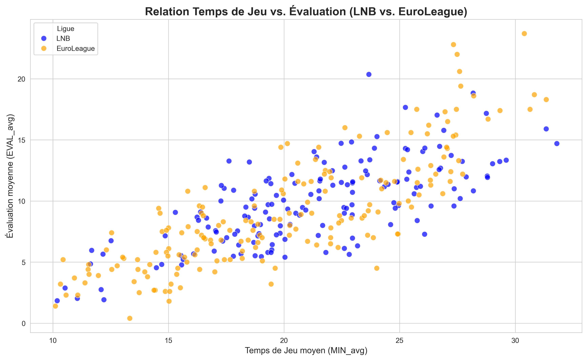
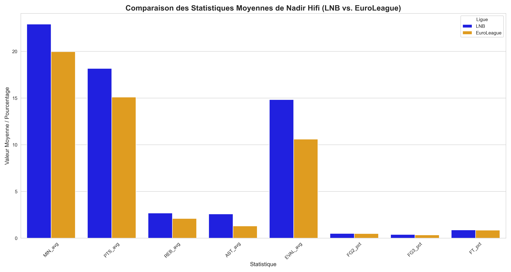

# Portfolio Data Science Freelance - Analyse Basket LNB & EuroLeague

Bonjour, je suis Abd-Allah AMINI, étudiant en Data Science à l'UTBM et passionné de Basket 🏀. 
Ce dépôt présente un projet démontrant mes compétences en acquisition, nettoyage, fusion et analyse de données sportives.

---

## Projet Principal : Fusion et Analyse des Statistiques LNB & EuroLeague (Saison 2024-2025)

Ce projet combine des données de deux sources distinctes pour créer un dataset unifié et réaliser des analyses comparatives.

### Compétences Démontrées :

* **Web Scraping Avancé :** Extraction de données via les API internes de `LNB.fr` et `Euroleaguebasketball.net`.
    * Voir les scripts : [`/scripts/`](./scripts/)
* **Nettoyage & Préparation de Données (`pandas`) :**
    * Standardisation des noms de colonnes et de joueurs.
    * Nettoyage et conversion des types de données (notamment les pourcentages).
    * Gestion des structures JSON imbriquées (`json_normalize`).
* **Fusion de Données (`pandas`) :** Combinaison de datasets hétérogènes (`pd.concat`).
* **Analyse Exploratoire & Visualisation (`matplotlib`, `seaborn`) :**
    * Comparaison des performances entre ligues.
    * Analyse de corrélations (Temps de jeu vs. Évaluation).
    * Comparaison individuelle des statistiques d'un joueur (Nadir Hifi).

### Le Processus Complet & les Résultats :

* **Notebook Jupyter :** L'ensemble du processus (nettoyage, fusion, analyse, visualisation) est détaillé dans ce notebook :
    * ➡️ [`/notebooks/fusion_stats_basket.ipynb`](./notebooks/fusion_stats_basket.ipynb) 📊
* **Dataset Final :** Le résultat de la fusion et du nettoyage :
    * [`/data_output/stats_basket_LNB_EuroLeague_2024_combined.csv`](./data_output/stats_basket_LNB_EuroLeague_2024_combined.csv)
* **Visualisations Clés :**
    * Comparaison Minutes vs. Évaluation (LNB vs. EuroLeague) :
        
    * Comparaison Stats Nadir Hifi (LNB vs. EuroLeague) :
        

---

## Mes Services Freelance

Basé sur les compétences démontrées dans ce projet, je propose les micro-services suivants :

1.  **Extraction de Données Web (Web Scraping)** : Automatisation de la collecte depuis des sites web, même complexes (API, JavaScript).
2.  **Nettoyage et Préparation de Données** : Transformation de vos fichiers (CSV, Excel, JSON) en datasets propres et structurés.
3.  **Analyse Exploratoire et Visualisation** : Création de graphiques clairs pour extraire des insights de vos données.

---

### Contact

Prêt à transformer vos données ? Contactez-moi sur [**Lien vers votre profil Fiverr/Malt/Upwork - À AJOUTER ICI !**].